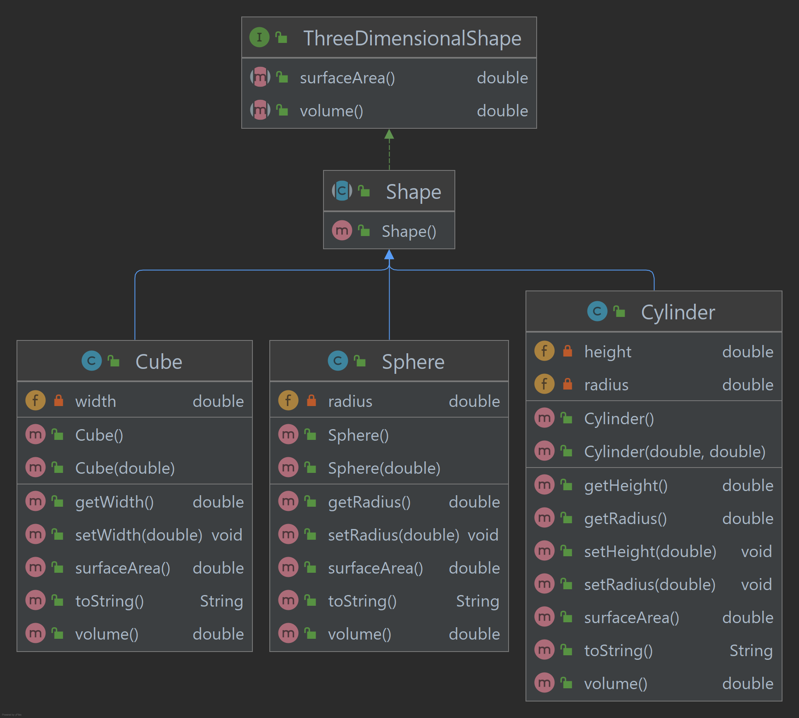

# Project 2
### Objectives
This assignment is designed to help you apply what you've learned about inheritance in Object-Oriented design.

### Concepts Covered
* Inheritance

### Details
* Review material on inheritance.  If you need a reference, try the tutorial found here https://www.tutorialspoint.com/java/java_inheritance.htm (Links to an external site.)
* Download the project template from https://github.com/UltimateSandbox/project-2-initial.git (Links to an external site.)
* Complete the following programming assignment:
* Design and implement a set of classes that define a series of three-dimensional geometric shapes.  The design is entirely up to you, but must include the following... 
* For each shape, store fundamental data about its size and provide methods to access and modify this data. 
* For each shape, provide appropriate methods to compute each shape’s surface area and volume given the appropriate inputs. 
* Your design must include at least one abstract class and one interface (but may include more if desired.)
* In your design, consider how shapes are related and thus where inheritance can be implemented. 
* Modify the driver class provided to instantiate several shapes of differing types and exercise the behavior you provided.  (i.e. print out it's state using the toString() method.)
* You should implement at least four shapes, including a sphere, which is given (but will need to be modified).
```
Hint:  
There are many types of 3 dimensional geometric shapes
to include in your design.  Try Googling 'list of 3d shapes' 
and see what you can come up with!
```
* The toString() method should print the name of the shape, its volume, and its surface area.  Take a look at the sphere class for an example of how this is done.
```text
Hint:  
Use the auto-generate feature in the IDE 
to generate the toString() method and add the necessary data to it.
```
An example of a 3 shape design is given below.  You may use these names and/or shapes or come up with your own appropriate naming convention.  It's up to you!


### Expected Output
Once you get your code working, when you run the driver, you should see something similar to the following:
```text
Sphere {radius=2.0, surface area=50.26548245743669, volume=33.510321638291124}
Cube {width=5.0, surface area=150.0, volume=125.0}
Cylinder {height=4.0, radius=1.0, surface area=31.41592653589793, volume=12.566370614359172}
```

### Extra Credit
If you would like up to 5 points extra credit for this assignment, write unit tests for your classes.  You only need tests for the methods that calculate volume and surface area for the points.  You may include other tests if you want to, but it won't add any more points to your score.

### Helpful Hints
* Utilize the Math class for the algorithm implementations.
* When implementing the algorithms, watch out for accidental integer division.  (3 is not the same type as 3.0)
* Utilize Google to find the formulas you're going to implement.
* Make good use of whitespace and comments to make your implementation as clean as possible.
* Use good, SOLID object-oriented programming principles (pun intended) in your implementation.

### Deliverables
* Be sure you commit & push your code to GitHub.  If you don't push it, I won't be able to see it!
* Copy the URL for your repo (green button on your GitHub repos' page) and paste it into the Website URL field and click Submit Assignment!
